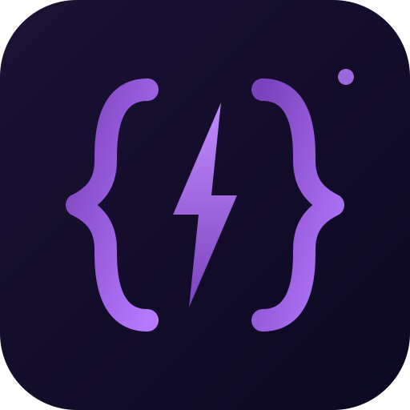

<p align="center">
  
</p>

# claude-skills-terraform

Claude Code skills for vibe-coding Terraform on the GCP + HashiCorp stack. Opinionated, composable, safety-first.

| Skill | Purpose | Default behaviour gate |
|---|---|---|
| [`tf-analyze`](skills/tf-analyze/) | Static + plan-time analysis with 60 catalogue-backed findings, CIS mapping, and delta tracking between runs. | Pre-commit / PR gate — posture issues surfaced before the refactor/test/cost loop. |
| [`tf-test`](skills/tf-test/) | Scaffold and run `terraform test` (HCL-native) with `mock_provider`, plus an opt-in Terratest fallback. | Gate `terraform apply` — fail fast on regressions before touching real cloud. |
| [`tf-refactor`](skills/tf-refactor/) | Safely rename, extract, import, or remove resources using `moved` / `import` / `removed` blocks. | Zero destroys for renames/moves — every destroy in a plan must be traced to an intent. |
| [`tf-cost`](skills/tf-cost/) | Estimate monthly cost, show plan-time dollar diffs, enforce budget gates. Wraps Infracost. | Never let an unreviewed cost delta reach apply. |

The four skills are designed to compose — see [docs/composition.md](docs/composition.md).

---

## Table of contents

- [What are Claude Code skills?](#what-are-claude-code-skills)
- [Prerequisites](#prerequisites)
- [Installation](#installation)
- [Quick start](#quick-start)
- [Skill reference](#skill-reference)
- [Composition](#composition)
- [Argument grammar](#argument-grammar)
- [Cloud scope](#cloud-scope)
- [Compatibility matrix](#compatibility-matrix)
- [Troubleshooting](#troubleshooting)
- [Contributing](#contributing)
- [License](#license)

---

## What are Claude Code skills?

[Claude Code skills](https://docs.claude.com/en/docs/claude-code/skills) are markdown files with YAML frontmatter that give Claude a pre-baked procedure for a specific task. When invoked via `/skill-name` or automatically when relevant, the skill's body is prepended to the model's context, overriding generic behaviour with a tailored playbook.

Each skill here is a single `SKILL.md`:

```
skills/tf-test/SKILL.md
skills/tf-refactor/SKILL.md
skills/tf-cost/SKILL.md
```

Frontmatter declares the skill `name`, `description`, allowed tools, model selection, and a hint for arguments. The body is free-form markdown the model will follow step-by-step.

---

## Prerequisites

| Tool | Version | Required for |
|---|---|---|
| [Claude Code](https://docs.claude.com/en/docs/claude-code) | Latest | All skills |
| Terraform | ≥ 1.6 | `tf-test`, `tf-refactor` |
| Terraform | ≥ 1.7 | `tf-test` (mock_provider), `tf-refactor` (`removed` block) |
| [Infracost](https://www.infracost.io/docs/) | ≥ 0.10 | `tf-cost` |
| `INFRACOST_API_KEY` env var | n/a | `tf-cost` (free tier — `infracost auth login`) |
| `GOOGLE_CREDENTIALS` env var | n/a | All apply-mode operations |
| HCP creds (`HCP_CLIENT_ID`, `HCP_CLIENT_SECRET`) | n/a | Any target that touches HCP |
| Go toolchain | ≥ 1.21 | Optional — only if using `tf-test`'s Terratest fallback |

---

## Installation

Claude Code discovers skills in two locations:

1. **User-global**: `~/.claude/skills/<skill-name>/SKILL.md` — available in every project.
2. **Project-local**: `<repo>/.claude/skills/<skill-name>/SKILL.md` — scoped to one repo, committed to share with the team.

Pick whichever fits. Project-local is recommended for teams so everyone gets the same version pinned in the repo.

### Option 1 — install script (recommended)

The included `install.sh` can symlink or copy the skills into either destination.

```bash
# User-global, symlinked (changes here propagate immediately — good for authoring)
./install.sh --target user --mode symlink

# User-global, copied (frozen snapshot — good for end users)
./install.sh --target user --mode copy

# Project-local, copied into the repo you run it from
./install.sh --target project --mode copy --project-dir /path/to/your/tf/repo

# Install only specific skills
./install.sh --target user --mode symlink --only tf-test,tf-cost
```

Run `./install.sh --help` for the full flag list.

### Option 2 — manual

```bash
# User-global
mkdir -p ~/.claude/skills
cp -R skills/tf-test skills/tf-refactor skills/tf-cost ~/.claude/skills/

# Project-local
mkdir -p /path/to/tf-repo/.claude/skills
cp -R skills/tf-test skills/tf-refactor skills/tf-cost /path/to/tf-repo/.claude/skills/
```

### Option 3 — git submodule (for teams)

```bash
cd /path/to/tf-repo
git submodule add https://example.com/claude-skills-terraform .claude/skills-vendor
ln -s .claude/skills-vendor/skills/tf-test .claude/skills/tf-test
ln -s .claude/skills-vendor/skills/tf-refactor .claude/skills/tf-refactor
ln -s .claude/skills-vendor/skills/tf-cost .claude/skills/tf-cost
```

### Verifying installation

In any Claude Code session, type `/` — the three skills should appear in the completion list with their descriptions. If not:

```bash
ls -la ~/.claude/skills/   # or <repo>/.claude/skills/
```

Confirm each `SKILL.md` is readable and has valid YAML frontmatter.

---

## Quick start

```
/tf-test action:scaffold target:tf/modules/vault-pki
/tf-test action:run target:tf/modules/vault-pki
/tf-refactor action:rename target:tf/scenarios/prod from:google_compute_instance.old to:google_compute_instance.new
/tf-cost action:diff target:tf/scenarios/prod env:prod
```

The skills are self-guiding — each will walk you through pre-flight checks, the action itself, and verification. If a pre-flight fails, the skill stops before making changes.

---

## Skill reference

### `tf-analyze`

Catalogue-backed Terraform analysis. 60 rule definitions with stable IDs, 40+ test fixtures, deterministic risk scoring, CIS benchmark mapping, and delta tracking between runs.

| Argument | Values | Purpose |
|---|---|---|
| `path:PATH` | directory | Scope analysis (default: repo root) |
| `focus:AREA` | `security`, `dry`, `style`, `robustness`, `simplicity`, `ops`, `cicd`, `all` | Area filter (default: `all`) |
| `format:MODE` | `markdown`, `json`, `sarif` | Output format (default: `markdown`) |
| `mode:MODE` | `static`, `diff`, `plan`, `verify-fixed`, `self-test` | Execution mode |
| `diff-base:REF` | git ref | Base branch for `mode:diff` (auto-detects `main`/`master`) |

SARIF output pairs with GitHub Code Scanning for inline PR annotation. See [skills/tf-analyze/SKILL.md](skills/tf-analyze/SKILL.md) for the full catalogue and execution modes.

### `tf-test`

Scaffold and run native Terraform tests. Default is plan-mode with `mock_provider` — no cloud credentials needed.

| Argument | Values | Purpose |
|---|---|---|
| `target:PATH` | module or scenario path | What to test |
| `action:VERB` | `scaffold`, `run`, `discover`, `triage` | Default: `run` if tests exist, else `scaffold` |
| `mode:MODE` | `plan`, `apply`, `mixed` | Default: `plan` |
| `name:FILE` | specific `.tftest.hcl` name | Scope to a single file |

Scaffold baseline for a new module produces four files: `defaults`, `validation`, `outputs`, `naming`. Scenarios add a phase-gate test where applicable.

See [skills/tf-test/SKILL.md](skills/tf-test/SKILL.md) for the full procedure.

### `tf-refactor`

Safe state surgery. Prefers declarative blocks over CLI commands.

| Argument | Values | Purpose |
|---|---|---|
| `target:PATH` | scenario or module path | Directory being refactored |
| `action:VERB` | `rename`, `extract`, `import`, `remove`, `for-each`, `triage` | Which refactor |
| `from:ADDRESS` | e.g. `google_compute_instance.old` | Source resource address |
| `to:ADDRESS` | e.g. `module.vault.google_compute_instance.server[0]` | Destination address |

Preference order: `moved` > `import` block > `removed` block > `terraform state mv/rm` > `terraform import` CLI. The skill enforces working-tree-clean, state backup, and zero-destroy verification before any apply.

See [skills/tf-refactor/SKILL.md](skills/tf-refactor/SKILL.md).

### `tf-cost`

Cost estimation and budget gating. Wraps Infracost.

| Argument | Values | Purpose |
|---|---|---|
| `target:PATH` | scenario or module path | What to price |
| `action:VERB` | `baseline`, `diff`, `breakdown`, `budget` | Default: `diff` if a plan exists, else `baseline` |
| `env:NAME` | `dev`/`staging`/`prod` | Picks tfvars and budget threshold |
| `threshold:USD` | e.g. `500` | Monthly ceiling for `budget` action |
| `format:MODE` | `table`, `json`, `html` | Output format |

Integrates with `tf-infra`'s apply confirmation (if you have it) — the cost delta appears next to add/change/destroy counts before the user types `yes`.

See [skills/tf-cost/SKILL.md](skills/tf-cost/SKILL.md).

---

## Composition

These skills are designed to be used together. The typical flow for a non-trivial change:

```
tf-refactor action:rename ...    # state-safe rename
tf-test action:run ...           # regression coverage
tf-cost action:diff ...          # cost sanity check
→ (existing) tf-infra action:apply ...
```

Details: [docs/composition.md](docs/composition.md).

---

## Argument grammar

All skills share a common argument convention: `key:value` pairs, whitespace-separated, in any order. See [docs/argument-grammar.md](docs/argument-grammar.md) for the full spec, quoting rules, and examples.

---

## Cloud scope

| Cloud / platform | Support |
|---|---|
| GCP | First-class — every example targets GCP |
| HashiCorp (Vault, Consul, Nomad, HCP) | First-class — provider-specific traps called out in each skill |
| AWS | Works but not prioritised — examples will need translation |
| Azure | Works but not prioritised — same |

The skills encode HashiCorp-specific operational knowledge in their bodies (Vault PKI patterns, Consul Dataplane, phase-gated applies, HCP tier pricing). For non-GCP, non-HashiCorp stacks, the skills remain useful but examples will need adaptation.

---

## Compatibility matrix

| Skill | Terraform min | Other deps |
|---|---|---|
| `tf-analyze` | 1.1 (static/diff); 1.5 (`mode:plan`) | Python ≥ 3.10, git |
| `tf-test` | 1.6 (1.7 for `mock_provider`) | Go ≥ 1.21 optional (Terratest fallback) |
| `tf-refactor` | 1.1 (`moved`), 1.5 (`import`), 1.7 (`removed`) | None |
| `tf-cost` | Any | Infracost ≥ 0.10, `INFRACOST_API_KEY` |

Each skill's pre-flight step rejects unsupported versions explicitly rather than failing opaquely later.

---

## Troubleshooting

### Skill doesn't appear in `/` completion

- Check `ls ~/.claude/skills/` (user-global) or `ls .claude/skills/` (project-local).
- Confirm YAML frontmatter is valid — the skill fails silently if `---` delimiters are missing or the `name` field is absent.
- Restart the Claude Code session — skills are loaded at session start.

### `tf-test` says "terraform version too old"

The pre-flight requires ≥ 1.6 for native tests and ≥ 1.7 for `mock_provider`. Upgrade or use the Terratest fallback (section 6 of `tf-test/SKILL.md`).

### `tf-refactor` plan shows unexpected destroys

This is the skill doing its job. Go to `action:triage` — it will localise each destroy line to one of: intended, rename/move, provider replace, or state drift. Never apply an unexplained destroy.

### `tf-cost` shows `$0/mo` for real resources

Two likely causes:
1. No `infracost-usage.yml` — usage-based resources (egress, Cloud Logging) need explicit usage estimates.
2. Resource not supported by Infracost — run `infracost breakdown --show-skipped` to confirm.

### Pre-flight demands credentials I don't have

All pre-flights fail closed on purpose. Obtain the relevant credential (GCP SA key, HCP service principal, Infracost API key) before re-running. The skill will not silently run with partial auth.

---

## Contributing

See [CONTRIBUTING.md](CONTRIBUTING.md) for the style guide, how to add a new skill, how to test changes, and the PR checklist.

---

## License

Apache-2.0. See [LICENSE](LICENSE).

---

## Related

- [Anthropic — Claude Code skills docs](https://docs.claude.com/en/docs/claude-code/skills)
- [HashiCorp — Terraform native testing](https://developer.hashicorp.com/terraform/language/tests)
- [Infracost](https://www.infracost.io/)
